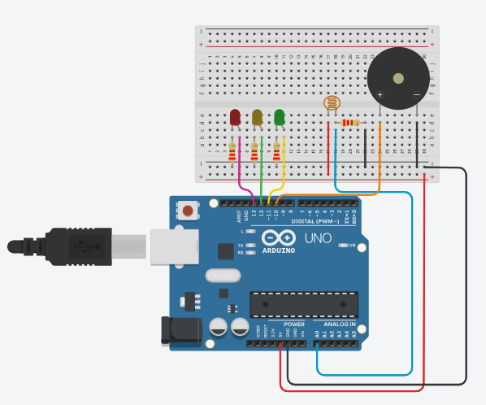

# Checkpoint 1
- Nesse arquivo README.MD, serão descritos todas os passos, processos, e eplicações para a formulação e entrega do nosso primeiro checkpoint

### Imagem final do projeto:

## Materiais utilizados: 
   - Uma Placa Arduino (como Arduino Uno, Arduino Nano, etc.)
   - Um Sensor de Luz (LDR) - Para detectar a intensidade da luz.
   - Um Buzzer/Piezo - Para gerar o som do alarme.
  ### LEDs:
   - Um LED verde conectado ao pino 11 do Arduino.
   - Um LED amarelo conectado ao pino 12 do Arduino.
   - Um LED vermelho conectado ao pino 13 do Arduino.
### Resistores:
   - Um resistor para o LDR (para formar um divisor de tensão).
   - Três Resistores para limitar a corrente dos LEDs.
   - Jumpers/Cabos - Para fazer as conexões entre os componentes e o Arduino.
   
### Dependências:
1. Arduino IDE: Você precisará do software Arduino IDE instalado em seu computador para programar a placa Arduino.
---

## O Código 
- O código que criamos foi para realizar um programa para um microcontrolador, como um Arduino, que lê um sensor de luz (LDR) que pesquisamos sobre para desenvolver essa atividade, e ele irá controlar LEDs e um buzzer com base nos valores lidos. Aqui está uma descrição simples do que o código faz:

1. Define constantes para os pinos dos componentes:
- BuzzerPin para o buzzer no pino 10
- LdrPin para o LDR no pino analógico 0
- LedVerde, ledAmarelo e ledVermelho para os LEDs nos pinos 11, 12 e 13, respectivamente.

2. Declara uma variável ldrValue para armazenar o valor lido do LDR e uma constante freq para a frequência do sonorizador.

3. No método setup():
- Inicia o monitor serial para exibir os valores lidos.
- Configura os pinos dos LEDs e buzzer como saídas.

4. No método loop():
- Lê o valor do sensor de luz usando analogRead(ldrPin).
- Com base no valor lido:
  - Se o valor for menor que 100, acende o LED verde.
  - Se o valor estiver entre 100 e 200, acende o LED amarelo e toca o buzzer por 3 segundos.
  - Se o valor for maior que 200, acende o LED vermelho.

6. Exibe o valor lido do sensor no monitor serial.

7.  A função apagaLeds() é usada para apagar todos os LEDs de uma vez, definindo todos os LEDs como LOW.
---

## Como reproduzir
- Separar todos os materiais utilizados.

Uma extremidade do LDR deve ser conectada ao pino A0 do Arduino.
A outra extremidade do LDR deve ser conectada ao GND do Arduino.
Um resistor (por exemplo, 10k ohms) deve ser conectado entre o pino A0 e o VCC (5V) do Arduino.

- LEDs:
  - LED verde ao pino 11 do Arduino com um resistor em série.
  - LED amarelo ao pino 12 do Arduino com um resistor em série.
  - LED vermelho ao pino 13 do Arduino com um resistor em série.

- Buzzer/Piezo:
  - Uma extremidade do buzzer deve ser conectada ao pino 10 do Arduino.
  - A outra extremidade do buzzer deve ser conectada ao GND do Arduino.
  
Depois de conectar todos os componentes conforme descrito e ter a Arduino IDE instalada em seu computador, você pode copiar e colar o código fornecido em um novo sketch na Arduino IDE, ou pode tentar reproduzir também, levando em conta a lógica utilizada. Compile o código e faça o upload para a sua placa Arduino.

Uma vez carregado, você verá os valores lidos pelo LDR no Monitor Serial da Arduino IDE e os LEDs e o buzzer se comportarão conforme a intensidade da luz detectada pelo sensor LDR, teste pressionando o lrd e aumentanto e diminuindo.

---
> **Em um breve resumo, o código monitora a intensidade da luz usando um LDR. Se a luz for fraca (valor < 100), acende o LED verde. Se estiver em um nível intermediário (100 <= valor <= 200), acende o LED amarelo e toca um alarme por 3 segundos. Se a luz for forte (valor > 200), acende o LED vermelho. O valor lido pelo sensor é exibido no monitor serial.**
---

## ESPERAMOS QUE TENHA GOSTADO DO NOSSO PROJETO!!!
### Integrantes do grupo + RM:
- Heloísa Real: 554535
- Hellen Moura: 559008
- Alexia Ramalho: 558355
- Lorenzo: 557397
- Eduardo: 556803
